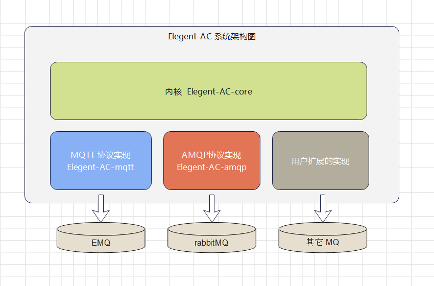

# ElegentAC【异步调用框架】

## 框架介绍

​	ElegentAC（异步调用框架）是一款基于MQ的微服务异步调用框架。 这个框架可以让你更优雅地在项目中编写微服务异步调用的代码。这个组件具有的特点：

1. 支持 MQTT ，rabbitMQ等多种MQ的实现方式，并支持用户自行扩展。
2. 用最优雅的方式实现了消息的接收处理。接收消息只需要通过注解指定主题名称，主题支持通配符和变量，消息自动转换为发送时的 DTO类型，无需手动转换。
3. 为异步调用的链路，产生一个唯一的链路ID，这个ID可以被应用系统用于记录日志等。


下面是ElegentAC的系统架构图： 



## 使用说明

### 准备工作

（1）在项目中按需引入依赖

如果是基于amqp协议的中间件 ，例如rabbitMQ ，则引入elegent-AC-amqp

```xml
<dependency>
    <groupId>cn.elegent.ac</groupId>
    <artifactId>elegent-AC-amqp</artifactId>
    <version>1.1.0</version>
</dependency>
```
如果是基于MQTT协议的中间件 ，例如EMQ ，则引入elegent-AC-mqtt

```xml
<dependency>
    <groupId>cn.elegent.ac</groupId>
    <artifactId>elegent-AC-mqtt</artifactId>
    <version>1.1.0</version>
</dependency>
```

（2）在项目配置文件添加配置，示例如下：

```yaml
elegent:
  ac:
    host: 127.0.0.1
    port: 1883
    clientId: testClient
    username: admin
    password: public
    keepAliveInterval: 30
    connectionTimeout: 60
spring:
  application:
    name: acdemo
```

注意：必须要有spring.application.name的配置

elegent.ac 配置说明：

| 配置                | 说明                  |
| ----------------- | ------------------- |
| host              | MQ的主机地址             |
| port              | MQ中间件的端口。 EMQ的是1883 |
| username          | 登录用户名               |
| password          | 登录密码                |
| clientId          | 客户端ID               |
| keepAliveInterval | 心跳检测（秒）             |
| connectionTimeout | 连接超时时间              |

（3）启动消息中间件。

### 代码编写

#### 调用服务（发送消息）

  类中引入 ElegentAC

```java
@Autowired
private ElegentAC elegentAc;  
```

 通过调用elegentAc的publish方法来实现服务调用（发送消息），示例如下：

```java
elegentAc.publish("testtopic",acdto);
```
参数1 ：主题名称，被调用的服务以这个主题来接收。

参数2 ：要发送的数据，可以自己定义一个DTO类封装你要传递的数据。

如果需要延迟发送，则需要调用elegentAc的delayPublish，示例如下：

```java
elegentAc.delayPublish("testtopic",acdto,60);
```

#### 接受调用（接收消息）

##### 消息处理类与@Topic注解

我们被调用的服务，如何接受消息呢？很简单，只需要编写一个类实现ACHandler接口，并指定泛型类型为接收数据的类型。另外在类上添加一个@Topic注解，并指定主题。代码示例如下：

```java
/**
 * 接收消息例子
 */
@Topic("testtopic")
public class ACDemoHander implements ACHandler<ACDTO> {

    @Override
    public void process(String topic,ACDTO dto) throws Exception {
        System.out.println("收到消息,主题："+topic+" 消息内容"+dto.getName());
        //todo: 调用业务处理类
    }
}
```

process方法的两个参数：

参数1 ：主题名称

参数2 ：传递的数据，与发送消息是同一类型。

##### 在@Topic中使用主题通配符

@Topic注解中定义的是主题名称，可以是一个确切的名称，也可以是一类主题，我们可以使用通配符来定义主题

`+`  单级通配符替换了一个主题级别。

`#`  多级通配符涵盖了许多主题级别。

示例：

```java
/**
 * 接收消息例子
 */
@Topic("server/#")
@Component
@Slf4j
public class ACDemo2Hander implements ACHandler<VmStatusContract> {

    @Override
    public void process(String topic,VmStatusContract dto) throws Exception {
        log.info(topic+"收到消息："+dto);
    }
}
```

主题`elegent/#`        可以匹配的主题有  `elegent/dog`   或   `elegent/dog/pig/man`  

主题`elegent/+/a/+`   可以匹配的主题有  `elegent/test/a/cat`   或  `elegent/woman/a/topic`

注意：通配符只能在topic注解中使用，发送消息不要使用通配符。

##### 在@Topic中使用变量引用

我们可以在@Topic注解中使用${}引用变量值。

示例如下：

```java
/**
 * 接收消息例子,主题中带变量
 */
@Topic("testtopic/${spring.application.name}")
@Component
@Slf4j
public class ACDemo3Hander implements ACHandler<ACDTO> {

    @Override
    public void process(String topic,ACDTO dto) throws Exception {
        log.info(topic+"收到消息："+dto.getName());
    }
}
```

上例中${spring.application.name}就是提取配置文件中的spring.application.name节点的配置。

#### 手动订阅与取消订阅

##### 手动订阅

一般情况下，不需要你手动订阅主题。 如果你想手动订阅某个主题，可以使用ElegentAC的subscribe方法来实现，示例代码：

类中引入 ElegentAC

```java
@Autowired
private ElegentAC elegentAc;  
```

通过调用acTemplate的subscribe方法来实现消息订阅，示例如下：

```java
elegentAc.subscribe(topics);
```

参数topics为Set<String> 类型

##### 取消订阅

如果你想取消某个主题的订阅，可以使用ElegentAC的unSubscribe方法来实现，示例代码：

类中引入 ElegentAC

```java
@Autowired
private ElegentAC elegentAc;  
```

通过调用elegentAc的unSubscribe方法取消一部分主题的订阅，示例如下：

```java
elegentAc.unSubscribe(topics);
```

参数topics为Set<String> 类型  

#### 获取链路ID

多个微服务进行异步调用，如何识别它们是同一个“链路”上的调用呢？我们可以通过获取链路ID 来实现。框架给出了获取链路ID的方法，代码如下：

```java
String chainId = ElegentACContext.get();
```

拿到这个ID，我们可以在业务代码做一些日志记录或其它业务逻辑处理。

## 参与贡献

1.  从 `master` 分支 `checkout` 一个新分支（**注**：*请务必保证 master 代码是最新的*）
2.  新分支命名格式：`docs/username_description`，例如：`docs/tom_新增分布式锁配置项`
3.  在新分支上编辑文档、代码，并提交代码
4.  最后 `PR` 合并到 `develop` 分支，等待作者合并即可


